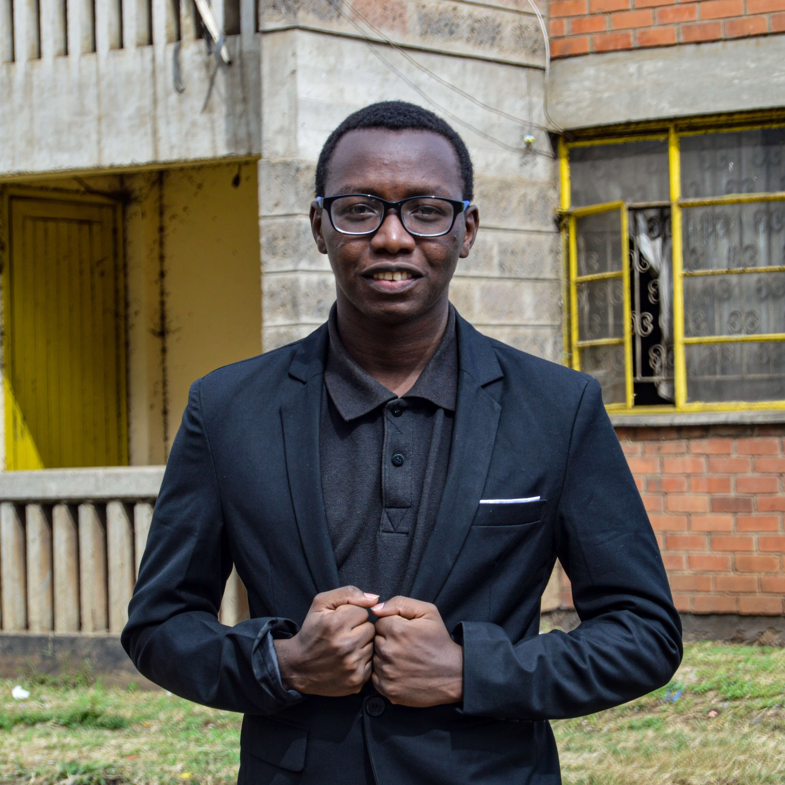

# Realtime AI Image Generator Application

## [Live Site](https://ai-image-generator-ten-rho.vercel.app/)

### Introduction
This is a AI image generator application powered by DALL-E.

It is built using React, MongoDB, Express, Cloudinary and OpenAi.

### Walkthrough:
- A user submits a request for an image,
- The request is processed by DALL-E
- The response is displayed to the user
- The user can then share the generated image to the community
- The image will be to a repository of generated images by the community

## Available pages
- Home
- Create Post

## Technologies
Client
- vite
- react
- mantine v6
- react-helmet
- react-router-dom

Server
- mongoose (mongodb)
- express
- dotenv
- cloudinary
